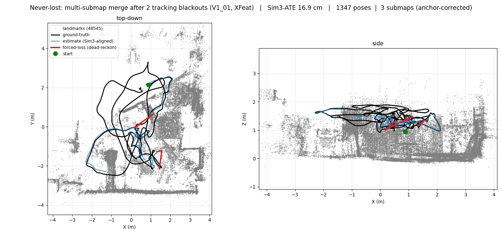
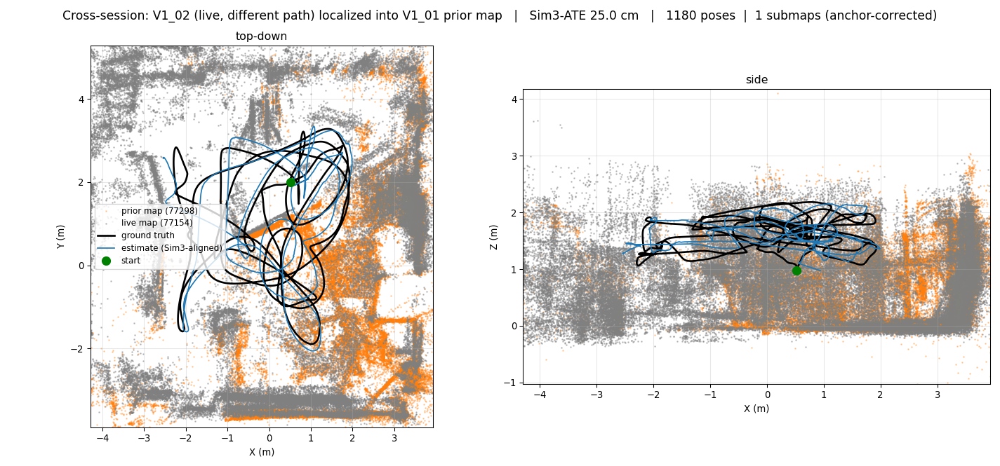

# slamko

**A modular, pluggable SLAM framework whose #1 job is to never get lost.**
Strong like ORB-SLAM3 / OKVIS2-X / VILENS, but built from a small core where **every
sensor and capability is a plugin behind a contract — not a rewrite.** Fast, robust,
super-recoverable, and deliberately **simple and stable**.

> **Status (2026-05-27) — the never-lost loop is closed end-to-end, including across
> sessions.** `slamko_core` shipped (header-only spine + map serialization, 26 tests).
> `slamko_vio` runs a CUDA stereo-inertial tracker with a **swappable feature front-end**
> — Shi-Tomasi (0.078 m ATE @ ~214 fps) or **XFeat-TensorRT** (**0.049 m @ ~93 fps**,
> learned 64-d descriptors) on EuRoC MH_01 — routed through a pluggable `LocalSmoother`
> (ceres **or** GTSAM). `slamko_fusion` (**P1 ✅**): GTSAM fixed-lag smoother +
> **marginalization**, tracks MH_01 end-to-end. `slamko_loop` (**P2 ✅ + P2.5**): the
> never-lost supervisor + XFeat relocalizer + a self-contained **SE3 pose-graph backend**
> (loop-closure-as-factor) — full `seal → branch → relocalize → WELD → recover` and
> **multi-submap merge** validated live on V1_01. **Cross-session (P4a/P4b ✅):** the Atlas
> persists to disk and a fresh session **relocalizes into a prior map** — both reactively
> (after a loss) and proactively (continuous reloc while OK); validated with a *different*
> trajectory (V1_02 → V1_01). **Scalable place-rec (P3 ✅):** a BoW vocabulary + inverted
> index pre-selects candidate submaps so relocalization stays sublinear in map count.
> Every run is gated by `scripts/check_neverlost.py`, and the whole pipeline reproduces with
> one command (`scripts/bench_neverlost.sh`). Full state + numbers:
> [`docs/SYSTEM.md`](docs/SYSTEM.md).

## The idea

SLAM systems usually fail in one of two ways: they **get lost** (lose tracking and
never recover), or they're a **monolith** (adding a sensor or swapping a feature
extractor means surgery on the whole estimator). slamko is built to avoid both.

**1. Never lost — three safety nets at three timescales.**

| When vision degrades | What catches it | Where |
|---|---|---|
| blur / occlusion (ms–0.5 s) | IMU + constant-velocity **dead-reckoning** | `slamko_vio` ✅ |
| medium loss (seconds) | **archive-don't-discard**: seal the submap, branch a fresh one, keep emitting odometry | `slamko_loop` ✅ |
| kidnap / long loss / new session | **relocalize** by XFeat appearance + **weld** as a pose-graph factor; merges multiple submaps and **prior-session maps** | `slamko_loop` ✅ |

Loss is detected by the **odometry stale-gap**, not a covariance spike — a blackout
*pauses* odometry, it doesn't inflate uncertainty (the OKVIS2-X lesson). All three nets
are validated end-to-end on EuRoC V1_01 (forced-loss + cross-session replays), gated by
`scripts/check_neverlost.py`.

**2. Pluggable — everything is a `Factor` behind a contract.** A sensor frontend
turns a measurement into factors `{keys, residual, √information, robust_kernel}`; a
backend (GTSAM / Ceres) owns the solve. Adding a sensor = *register a frontend*.
Swapping the feature extractor (Shi-Tomasi ↔ XFeat ↔ LiftFeat-m1) = *register a
`FeatureSource`* — no other module changes. Degradation is **covariance inflation,
never an `if(sensor_ok)` branch**.

**3. Two graphs, never coupled.** A fast bounded **local smoother** (real-time pose,
owns `odom→base`) runs independently of a slow async **global graph** (loop closure,
recovery, owns `map→odom`). The global graph is *disposable* — it can be damped or
rebuilt from the still-trusted odometry without ever stalling the tracker.

Five principles, one per reference system: robustness-by-deletion (RKO-LIO),
covariance-not-branches (VILENS), disposable-global-graph (GLIM), decouple-at-a-map-
contract (DigiForest), recovery-as-state-machine (ORB-SLAM3). See
[`MASTER_PLAN.md`](MASTER_PLAN.md).

## Architecture

```
sensors ─► slamko_vio ──► EstimationFrame ─► slamko_fusion ──► SubMap ─► slamko_loop
 (D455/    FeatureSource   (T_WB, v, bias)   fixed-lag         (KF poses,  place-rec +
  EuRoC)   →Tracker→PnP                      smoother +         landmarks,  never-lost
           +IMU +DR                          marginalization    descriptors) supervisor
           owns odom→base                                                    owns map→odom
                                  └────────────► slamko_ros (composition root, bridge, viz)
```

Three tiers, two graphs, three TF owners — full data-flow + threading model +
glossary in [`docs/SYSTEM.md`](docs/SYSTEM.md).

## Packages (lean: 6, + 3 deferred)

| Package | Role |
|---|---|
| **`slamko_core`** | contracts (`Factor`/`SensorFrontend`/`FactorGraphBackend`/`FeatureSource`/`Relocalizer`) + types + SE3 + health signals + **SubMap serialization**. Header-only, Eigen-only. ✅ |
| **`slamko_vio`** | the fast visual-inertial tracker: swappable feature front-end (Shi-Tomasi / XFeat-TRT) + KLT + stereo + PnP + IMU + dead-reckoning, routed through `LocalSmoother` (ceres/gtsam). Disjoint per-submap maps. ✅ |
| **`slamko_fusion`** | GTSAM fixed-lag smoother + marginalization (Schur + FEJ), the VILENS heart, behind `LocalSmoother`. Tracks MH_01 end-to-end. ✅ |
| **`slamko_loop`** | global graph + **SE3 pose-graph backend** (loop-closure-as-factor) + XFeat relocalization + **BoW inverted-index** (scalable candidate pre-selection) + the never-lost supervisor + cross-session Atlas seeding. ✅ |
| **`slamko_msgs`** | ROS 2 interface defs (map-server API). _planned (P4, with map-server)_ |
| **`slamko_ros`** | ROS 2 integration: nodes, `map→odom→base` bridge, visualization. _planned_ |

Deferred until their phase: `slamko_mapping` (P4 — map persistence lives in `slamko_core`
for now; splits out with the map-server contract), `slamko_sensors` (P5),
`slamko_semantic` (P6).

## Results — what it looks like

Validated end-to-end on EuRoC V1 (Vicon room). Submaps are **connected via the
pose-graph, never fused** — the "merged" map is the union of `anchor·landmarks`, so each
panel below overlays the anchor-corrected submaps in one frame (ground truth black,
estimate blue, landmarks grey/orange). Every run is gated by `scripts/check_neverlost.py`
(PASS/FAIL); figures rendered by `scripts/plot_neverlost.py`.

**Never-lost recovery + multi-submap merge (single session).** Two forced tracking
blackouts → seal + branch + relocalize + WELD; the disjoint submaps re-anchor into one
coherent room (Sim3-ATE 16.9 cm; the red segments are the IMU dead-reckoning through each
blackout).



**Cross-session relocalization.** A *different* trajectory (V1_02, faster path) loads
V1_01's saved map and localizes into it — orange = the prior map from disk, grey = the live
map, overlapping in the room (real 41 cm cross-session offset; weld in the OK state, no loss
needed; Sim3-ATE 25 cm).



## Build & run

```bash
# Colcon workspace (needs ROS 2 jazzy, CUDA, Ceres, OpenCV; TensorRT for XFeat).
cd ~/coding/slamko
colcon build --cmake-args -DCMAKE_BUILD_TYPE=Release
source install/setup.bash

# EuRoC bench (needs ~/datasets/euroc + the euroc_publisher workspace):
bash scripts/bench_ate.sh MH_01_easy                         # Shi-Tomasi baseline
ros2 launch slamko_vio vio_euroc.launch.py seq:=<MH_01> feature_source:=xfeat  # XFeat-TRT

# Never-lost + cross-session: session 1 maps + saves the Atlas; session 2 loads it
# and relocalizes into it (continuous reloc, no loss needed).
ros2 launch slamko_vio vio_euroc.launch.py seq:=<V1_01> feature_source:=xfeat \
  enable_neverlost:=true neverlost_use_pose_graph:=true \
  map_save_dir:=/tmp/site_map                                # build + persist
ros2 launch slamko_vio vio_euroc.launch.py seq:=<V1_01> feature_source:=xfeat \
  enable_neverlost:=true neverlost_use_pose_graph:=true neverlost_continuous_reloc:=true \
  prior_map_dir:=/tmp/site_map                               # relocalize into prior map

# One-command regression: build a map, relocalize a DIFFERENT trajectory into it,
# auto-check both (exit 0 = the whole never-lost + cross-session pipeline works).
bash scripts/bench_neverlost.sh V1_01_easy V1_02_medium

# Validate any never-lost run (PASS/FAIL gate) + plot the corrected/merged map:
python3 scripts/check_neverlost.py --log run.log --gt GT.tum --est est.tum \
  --submaps est_lm.csv.submaps --pose-epoch est.tum.epoch
python3 scripts/plot_neverlost.py --gt GT.tum --est est.tum --landmarks est_lm.csv \
  --submaps est_lm.csv.submaps --pose-epoch est.tum.epoch --prior-map-dir /tmp/site_map --out merge.png
```

## Docs

- [`docs/SYSTEM.md`](docs/SYSTEM.md) — **start here**: the system map + status-at-a-glance + where every note lives.
- [`MASTER_PLAN.md`](MASTER_PLAN.md) — vision, locked decisions, phased roadmap.
- [`docs/DECOUPLING.md`](docs/DECOUPLING.md) — the `slamko_core` contracts.
- [`CLAUDE.md`](CLAUDE.md) — orientation + working rules.

## License

Apache-2.0 / BSD-3 dependencies only (GTSAM, Ceres, XFeat/LiftFeat, DBoW2). No GPL code shipped.
